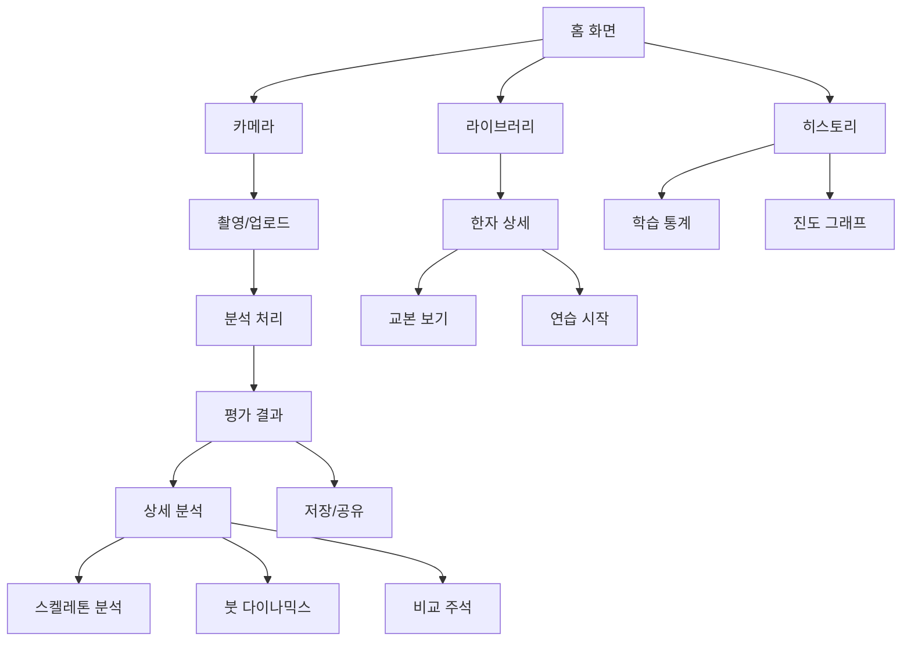

# 📱 한자 학습 분석 앱 - 통합 기획안

## 1. 프로젝트 개요

### 1.1 프로젝트명
**"서예마스터 (Calligraphy Master)"** - AI 기반 한자 서예 학습 앱

### 1.2 목적
- 한자 서예 학습자를 위한 AI 기반 실시간 분석 및 피드백 시스템
- 스켈레톤 분석을 통한 획순, 압력, 속도 등 정밀 분석
- 개인 맞춤형 학습 경로 제공

### 1.3 핵심 가치
- **정확성**: 스켈레톤 기반 정밀 분석
- **즉시성**: 실시간 피드백 제공
- **맞춤화**: 개인별 학습 데이터 기반 추천

---

## 2. 핵심 기능 설계

### 2.1 기존 UI 기능 (디자인 소스 기반)

#### 📱 **메인 화면 구성**
```
┌─────────────────────┐
│    홈 스크린         │
├─────────────────────┤
│  - 오늘의 한자       │
│  - 최근 학습 이력    │
│  - 빠른 시작 버튼    │
└─────────────────────┘
```

**주요 탭 네비게이션:**
1. **홈** - 대시보드 및 빠른 시작
2. **라이브러리** - 한자 목록 및 교본
3. **카메라** - 촬영 및 분석
4. **히스토리** - 학습 기록
5. **설정** - 개인 설정

#### 📷 **카메라 스크린**
- 실시간 카메라 프리뷰
- 그리드 가이드라인
- 촬영 버튼
- 갤러리 업로드

#### 📊 **평가 결과 스크린**
```typescript
interface EvaluationData {
  character: string;      // 분석 한자
  finalScore: number;     // 종합 점수
  scores: {
    margin: number;      // 여백 점수
    angle: number;       // 각도 점수
    center: number;      // 중심 점수
    shape: number;       // 형태 점수
    guide: number;       // 가이드 준수도
  };
  grade: string;         // 등급 (A+, B, C+...)
  improvement: string;   // 개선도
}
```

### 2.2 신규 추가 기능 (AI 분석 기반)

#### 🔬 **스켈레톤 분석 시스템**

```python
class SkeletonAnalyzer:
    """글자의 골격 분석"""
    
    def extract_skeleton(binary_img):
        # Zhang-Suen thinning 알고리즘
        # 글자 중심선 추출
        
    def analyze_stroke_angles(skeleton):
        # PCA 기반 획 방향 분석
        # 수직/수평/대각선 편차 측정
        
    def measure_stroke_thickness(binary_img, skeleton):
        # Distance Transform 활용
        # 획별 굵기 및 균일도 측정
```

**분석 결과:**
- 획별 기울기 (도 단위)
- 굵기 균일도 (%)
- 주요 특징점 (끝점, 교차점)
- Hausdorff 거리 기반 유사도

#### 🖌️ **붓 다이나믹스 분석**

```python
class BrushDynamicsAnalyzer:
    """붓 움직임 및 압력 추정"""
    
    def trace_skeleton_path(skeleton):
        # 스켈레톤 경로 추적
        # 시작점 → 끝점 순서 파악
        
    def estimate_pressure_from_thickness(binary_img, path):
        # 굵기 변화 → 압력 추정
        # 압력 피크/밸리 검출
        
    def analyze_stroke_direction(path):
        # 이동 방향 벡터 계산
        # 속도 프로파일 생성
```

**시각화 결과:**
- 붓 이동 방향 (화살표 맵)
- 압력 분포 히트맵
- 속도 변화 그래프
- 추정 획순

#### 🎯 **비교 분석 및 주석 시스템**

```python
class BrushComparisonAnnotator:
    """교본과 사용자 글자 비교"""
    
    def compare_pressure_profiles(user, reference):
        # 압력 프로파일 비교
        # 차이점 정량화
        
    def compare_speed_profiles(user, reference):
        # 속도 프로파일 비교
        # 빠름/느림 구간 검출
        
    def create_annotated_image(user_img, comparisons):
        # 글자 위 직접 표시
        # 색상 코드 및 마커
```

**주석 표시:**
- 🔴 너무 세게 누른 부분
- 🟠 너무 약하게 누른 부분
- ➡️ 너무 빠른 구간
- → 너무 느린 구간
- ⭕ 주요 개선 필요 지점

---

## 3. 기술 스택

### 3.1 프론트엔드
- **Framework**: React + TypeScript
- **UI Library**: Shadcn/ui (이미 구현됨)
- **Styling**: Tailwind CSS
- **State**: Zustand/Context API

### 3.2 백엔드 (분석 엔진)
- **Language**: Python 3.9+
- **Image Processing**: OpenCV
- **Skeleton Analysis**: scikit-image
- **Machine Learning**: TensorFlow/PyTorch (선택적)
- **API**: FastAPI

### 3.3 데이터베이스
- **User Data**: PostgreSQL
- **Image Storage**: AWS S3 / Firebase Storage
- **Cache**: Redis

---

## 4. 화면 흐름도



---

## 5. 데이터 구조

### 5.1 분석 결과 데이터

```typescript
interface AnalysisResult {
  // 기본 정보
  id: string;
  userId: string;
  timestamp: Date;
  character: string;
  
  // 점수
  scores: {
    overall: number;
    margin: number;
    angle: number;
    center: number;
    shape: number;
    guide: number;
  };
  
  // 스켈레톤 분석
  skeleton: {
    angles: StrokeAngle[];
    thickness: ThicknessProfile;
    keyPoints: KeyPoint[];
    similarity: number;
  };
  
  // 붓 다이나믹스
  dynamics: {
    pressure: PressurePoint[];
    speed: SpeedPoint[];
    strokeOrder: number[];
    features: StrokeFeatures;
  };
  
  // 비교 분석
  comparison: {
    pressureDiff: DifferencePoint[];
    speedDiff: DifferencePoint[];
    problemAreas: ProblemArea[];
    suggestions: string[];
  };
  
  // 이미지
  images: {
    original: string;      // 원본
    skeleton: string;      // 스켈레톤
    annotated: string;     // 주석
    heatmap: string;       // 히트맵
  };
}
```

### 5.2 학습 진도 데이터

```typescript
interface LearningProgress {
  userId: string;
  character: string;
  attempts: number;
  bestScore: number;
  averageScore: number;
  lastAttempt: Date;
  improvements: Improvement[];
  masteryLevel: number; // 0-100
}
```

---

## 6. API 엔드포인트

### 6.1 분석 API

```yaml
POST /api/analyze
  body:
    image: base64
    character: string
    mode: 'skeleton' | 'dynamics' | 'full'
  response:
    analysisId: string
    result: AnalysisResult

GET /api/analysis/{id}
  response:
    result: AnalysisResult
    
POST /api/compare
  body:
    userImageId: string
    referenceId: string
  response:
    comparison: ComparisonResult
```

### 6.2 학습 데이터 API

```yaml
GET /api/progress/{userId}
  response:
    characters: LearningProgress[]
    statistics: OverallStats
    
GET /api/history/{userId}
  query:
    limit: number
    offset: number
  response:
    history: AnalysisResult[]
    total: number
```

---

## 7. 개발 로드맵

### Phase 1: MVP (4주)
- [ ] 기본 UI 구현 (React)
- [ ] 카메라 촬영 기능
- [ ] 기본 평가 시스템
- [ ] 결과 저장

### Phase 2: AI 분석 (6주)
- [ ] 스켈레톤 추출 엔진
- [ ] 획 분석 알고리즘
- [ ] 압력/속도 추정
- [ ] 비교 분석

### Phase 3: 고급 기능 (4주)
- [ ] 실시간 분석
- [ ] 학습 추천 시스템
- [ ] 소셜 기능
- [ ] 게임화 요소

### Phase 4: 최적화 (2주)
- [ ] 성능 최적화
- [ ] UX 개선
- [ ] A/B 테스트
- [ ] 배포

---

## 8. 성공 지표 (KPI)

### 8.1 사용자 관련
- **DAU** (Daily Active Users): 1,000명 목표
- **평균 세션 시간**: 15분 이상
- **재방문율**: 40% 이상

### 8.2 학습 효과
- **평균 점수 향상도**: 20% 이상
- **완주율**: 60% 이상
- **만족도**: 4.5/5 이상

### 8.3 기술 지표
- **분석 정확도**: 95% 이상
- **처리 시간**: 3초 이내
- **오류율**: 1% 미만

---

## 9. 수익 모델

### 9.1 프리미엄 구독
- **기본**: 하루 10회 분석
- **프로**: 무제한 + 상세 분석
- **마스터**: 프로 + 1:1 코칭

### 9.2 인앱 구매
- 추가 한자 팩
- 특별 교본
- 분석 크레딧

### 9.3 B2B
- 학교/학원 라이선스
- API 제공
- 화이트 라벨

---

## 10. 위험 요소 및 대응

### 10.1 기술적 위험
- **문제**: 분석 정확도 부족
- **대응**: 지속적인 모델 개선, 사용자 피드백 수집

### 10.2 사업적 위험
- **문제**: 낮은 사용자 유지율
- **대응**: 게임화, 소셜 기능 강화

### 10.3 경쟁 위험
- **문제**: 유사 서비스 출시
- **대응**: 차별화된 AI 기술, 빠른 기능 업데이트

---

## 11. 팀 구성

### 필요 인력
- **PM**: 1명
- **프론트엔드**: 2명
- **백엔드**: 2명
- **AI/ML**: 1명
- **디자이너**: 1명
- **QA**: 1명

### 협업 도구
- **개발**: GitHub
- **디자인**: Figma
- **문서**: Notion
- **커뮤니케이션**: Slack

---

## 12. 예산 계획

### 초기 개발 (6개월)
- 인건비: $300,000
- 인프라: $10,000
- 도구/라이선스: $5,000
- 마케팅: $20,000
- **총계**: $335,000

### 운영 비용 (월간)
- 서버/클라우드: $2,000
- API/서비스: $500
- 유지보수: $5,000
- **총계**: $7,500/월

---

## 부록: 기술 상세

### A. 스켈레톤 추출 알고리즘
```python
# Zhang-Suen Thinning Algorithm
def skeletonize(image):
    """
    이진 이미지에서 1픽셀 두께의 스켈레톤 추출
    반복적으로 경계 픽셀을 제거하여 중심선만 남김
    """
    skeleton = image.copy()
    while True:
        # Step 1: 북서 경계 제거
        # Step 2: 남동 경계 제거
        if not pixels_removed:
            break
    return skeleton
```

### B. 압력 추정 공식
```
압력 = f(굵기, 농도, 번짐)
     = α * thickness + β * density + γ * blur_amount
     
where:
  α, β, γ = 학습된 가중치
  thickness = 거리 변환값 * 2
  density = 픽셀 밀도
  blur_amount = 가우시안 블러 차이
```

### C. 획순 추정 규칙
1. 위에서 아래로 (y좌표 우선)
2. 왼쪽에서 오른쪽으로 (x좌표 차선)
3. 가로획 다음 세로획
4. 삐침(丿) 다음 파임(乀)
5. 외곽 다음 내부

---

이 기획안은 기존 디자인 소스코드와 새로 개발한 AI 분석 기능을 통합한 종합적인 한자 학습 앱 개발 계획입니다.