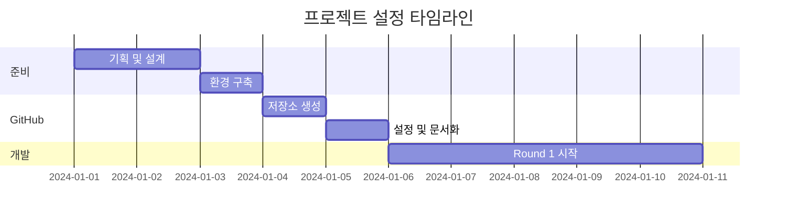

# AI 엔진을 탑재한 모바일 서비스 - 프로젝트 설정 템플릿

## 📋 개요
이 템플릿은 AI CLI 팀과 협업하여 AI 기반 모바일 서비스를 개발하는 프로젝트의 표준 설정 가이드입니다.

## 🚀 프로젝트 설정 단계별 가이드

### Phase 1: 프로젝트 기획 및 준비

#### 1.1 프로젝트 정의
```yaml
프로젝트명: [프로젝트명]
설명: AI 기반 [서비스 설명]
타겟 사용자: 
  - Primary: [주요 사용자]
  - Secondary: [부가 사용자]
핵심 가치:
  - [가치 1]
  - [가치 2]
  - [가치 3]
```

#### 1.2 팀 구성
```yaml
PM/기획: Claude Code (메인 창)
Backend/AI: Gemini CLI
Mobile/Frontend: Claude CLI
Design/QA: Cursor CLI (ChatGPT-5)
Infrastructure: Codex CLI (Omni)
```

#### 1.3 기술 스택 결정
```yaml
Frontend:
  - React Native (Expo)
  - TypeScript
  - 상태관리: Zustand
  - 네비게이션: React Navigation

Backend:
  - Python FastAPI
  - PostgreSQL
  - Redis
  - WebSocket

AI/ML:
  - Ollama (로컬 AI)
  - 선택 모델: Mixtral, LLaVA
  - PyTorch
  - MediaPipe (비전)

Infrastructure:
  - Docker
  - GitHub Actions
  - 로컬 서버 (개발)
  - 클라우드 (프로덕션)
```

### Phase 2: 로컬 환경 구축

#### 2.1 프로젝트 폴더 생성
```bash
# 루트 폴더 생성
mkdir ~/[project-name]-v2
cd ~/[project-name]-v2

# 기본 구조 생성
mkdir -p {apps,services,packages,infrastructure,docs}
mkdir -p .github/{workflows,ISSUE_TEMPLATE}
mkdir -p docs/{planning,architecture,guides,sessions,retrospectives,templates}
mkdir -p archive/{planning,test-results,ai-research}
```

#### 2.2 기본 파일 생성
```bash
# README.md
# .gitignore
# package.json (모노레포)
# PROJECT_STRUCTURE.md
```

#### 2.3 문서 구조
```
docs/
├── planning/
│   ├── master-plan.md        # 전체 기획
│   ├── feature-list.md       # 기능 목록
│   └── round-X-issues.md     # 회차별 이슈
├── architecture/
│   ├── technical-architecture.md
│   ├── api-specification.md
│   └── ai-model-guide.md
├── guides/
│   ├── ai-cli-guide.md       # CLI 협업 가이드
│   ├── development-guide.md
│   └── deployment-guide.md
├── sessions/
│   ├── session-management-guide.md
│   ├── project-context.yaml
│   └── session-XX-handover.md
└── retrospectives/
    └── round-XX-retrospective.md
```

### Phase 3: GitHub 설정

#### 3.1 저장소 생성
```bash
# GitHub.com에서
1. New repository
2. Repository name: [project-name]-v2
3. Description: AI-powered [service description]
4. Public/Private 선택
5. Initialize 없이 생성 (로컬에 이미 있음)
```

#### 3.2 로컬 Git 설정
```bash
cd ~/[project-name]-v2
git init
git branch -m main
git add .
git commit -m "Initial commit: Project structure and documentation"
git remote add origin https://github.com/[username]/[project-name]-v2.git
git push -u origin main
```

#### 3.3 GitHub Features 설정
Repository Settings에서:
- ✅ Wikis
- ✅ Issues
- ✅ Projects (classic)
- ✅ Discussions

#### 3.4 Branch Protection Rules
Settings → Branches → Add rule:
- Branch name pattern: `main`
- ✅ Require pull request reviews
- ✅ Dismiss stale pull request approvals
- ✅ Require status checks to pass
- ✅ Require branches to be up to date

#### 3.5 Labels 생성
```yaml
Priority:
  P0-Critical: #FF0000
  P1-High: #FF8C00
  P2-Medium: #FFD700
  P3-Low: #32CD32

Team:
  gemini-backend: #9370DB
  claude-frontend: #4169E1
  cursor-design-qa: #FF69B4
  codex-infra: #708090

Type:
  bug: #d73a4a
  feature: #0e8a16
  docs: #0052cc
  test: #fbca04
  task: #555555
  retrospective: #7e3c8b
```

#### 3.6 Project Board 생성
- 이름: "[Project Name] Development"
- 템플릿: Basic kanban
- 컬럼: Backlog | In Progress | In Review | Done

#### 3.7 Milestones 생성
```
R1: Foundation (회차 1-5)
R2: Core Features (회차 6-15)
R3: Advanced (회차 16-25)
R4: Polish (회차 26-30)
```

### Phase 4: 개발 프로세스 설정

#### 4.1 회차 기반 개발
```yaml
특징:
  - 시간 기반이 아닌 회차 기반
  - 각 회차는 명확한 목표
  - 회차 종료 시 회고
  - 유연한 일정 조정

프로세스:
  1. PM이 Issue 생성
  2. CLI에게 할당
  3. 작업 진행
  4. Issue 댓글로 소통
  5. 완료 및 리뷰
  6. 다음 회차 준비
```

#### 4.2 Issue 템플릿
```markdown
Title: [R{회차}] {작업명}
Assignee: @{cli-name}
Labels: task, {team-label}, {priority}
Milestone: R{X}

## 📋 작업 개요
[작업 설명]

## 🎯 완료 조건
- [ ] 조건 1
- [ ] 조건 2

## 📎 참고 자료
- 관련 문서:
- 의존성: #

## 💬 커뮤니케이션 로그
<!-- 모든 소통 기록 -->
```

#### 4.3 커뮤니케이션 프로토콜
```markdown
1. 작업 시작 알림
2. 진행 상황 보고 (필요시)
3. 블로커 즉시 보고
4. 완료 보고 및 PR
5. PM 리뷰 및 피드백
```

### Phase 5: AI 엔진 설정

#### 5.1 로컬 AI 환경
```bash
# Ollama 설치
curl -fsSL https://ollama.ai/install.sh | sh

# 모델 다운로드
ollama pull mixtral
ollama pull llava
ollama pull [custom-model]

# 설정
~/ollama/models/
├── shared/          # 공용 모델
├── [project]/       # 프로젝트 전용
└── config.yaml
```

#### 5.2 AI 모델 계획
```yaml
필요 모델:
  텍스트 분석: Mixtral 7B
  이미지 이해: LLaVA 7B
  커스텀 모델:
    - 품질 평가: 50-100M 파라미터
    - 실시간 분석: 10-20M 파라미터
    - 특화 기능: 20-30M 파라미터

리소스 요구사항:
  개발: M1/M2 Mac 32GB RAM
  학습: GPU 서버 (필요시)
  추론: 로컬 가능
```

### Phase 6: 세션 관리 시스템

#### 6.1 세션 문서
```yaml
목적: 대화 세션 간 연속성 유지
위치: docs/sessions/

핵심 파일:
  - project-context.yaml    # 프로젝트 정보
  - session-XX-handover.md  # 세션 인계
  - session-management-guide.md
```

#### 6.2 Claude 프로젝트 설정
```markdown
Custom Instructions:
- 프로젝트명: [Project Name]
- GitHub: [URL]
- 로컬: ~/[project-name]-v2
- 역할: PM
- 팀: 4 AI CLIs
- 세션: docs/sessions/
```

#### 6.3 IDE 설정
```bash
# .cursorrules 생성
# 프로젝트 컨텍스트 포함
# 각 CLI 역할 명시
```

### Phase 7: 첫 번째 회차 시작

#### 7.1 Round 1 Issues
```yaml
Issue #1: 인프라 구축 (Codex)
Issue #2: Backend 초기화 (Gemini)
Issue #3: Mobile 앱 생성 (Claude)
Issue #4: 디자인 시스템 (Cursor)
Issue #5: PM 대시보드 (PM)
```

#### 7.2 체크리스트
- [ ] 모든 문서 생성
- [ ] GitHub 설정 완료
- [ ] Issues 생성
- [ ] CLI 초대
- [ ] 개발 환경 테스트

## 📊 예상 타임라인



## 🔧 유용한 스크립트

### 프로젝트 초기화 스크립트
```bash
#!/bin/bash
PROJECT_NAME=$1
mkdir -p ~/${PROJECT_NAME}-v2
cd ~/${PROJECT_NAME}-v2

# 폴더 구조 생성
mkdir -p {apps,services,packages,infrastructure,docs}
# ... (전체 구조)

# Git 초기화
git init
git branch -m main

echo "✅ Project ${PROJECT_NAME} initialized!"
```

### 세션 백업 스크립트
```bash
#!/bin/bash
cd ~/[project-name]-v2
git add docs/sessions/
git commit -m "docs: Update session handover"
git push origin main
```

## 📌 핵심 원칙

1. **문서화 우선**: 모든 결정사항 기록
2. **비동기 협업**: Issue 댓글 활용
3. **회차 기반**: 유연한 일정 관리
4. **자동화**: 반복 작업 스크립트화
5. **품질 유지**: 코드 리뷰 필수

---

이 템플릿을 기반으로 새로운 AI 기반 모바일 서비스 프로젝트를 효율적으로 시작할 수 있습니다.