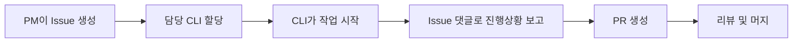

# AI CLI Guide

## 👥 AI CLI 팀 구성

### 팀 멤버 및 역할

| CLI | 역할 | 담당 영역 | GitHub Label |
|-----|------|----------|--------------|
| **PM Claude** | 프로젝트 매니저 | 전체 관리, 조율, 문서화 | `pm-claude` |
| **Gemini CLI** | 백엔드 개발자 | FastAPI, DB, AI 통합 | `gemini-backend` |
| **Claude CLI** | 모바일 개발자 | React Native, UI 구현 | `claude-frontend` |
| **Cursor CLI** | 디자이너/QA | UI/UX, 테스트, 품질관리 | `cursor-design-qa` |
| **Codex CLI** | 인프라 엔지니어 | DevOps, CI/CD, 환경구축 | `codex-infra` |

## 🔄 워크플로우

### 1. 작업 시작 프로세스


### 2. 커뮤니케이션 규칙
- **주요 채널**: GitHub Issues 댓글
- **진행 보고**: 매 작업 단위마다 Issue 업데이트
- **질문/블로커**: Issue에 `help wanted` 라벨 추가
- **완료 보고**: PR 생성 시 Issue 번호 참조

## 📋 CLI별 상세 가이드

### PM Claude (프로젝트 매니저)

**책임 영역**:
- 전체 프로젝트 일정 관리
- Issue 생성 및 할당
- 회차별 계획 수립
- 문서화 및 Wiki 관리
- 팀 조율 및 블로커 해결

**작업 방식**:
```bash
# Issue 생성 예시
gh issue create \
  --title "[R1] 작업 제목" \
  --body "작업 내용" \
  --label "P1-High,gemini-backend" \
  --milestone "R1: Foundation"

# 진행상황 체크
gh issue list --assignee @gemini-cli
```

**체크리스트**:
- [ ] 매 회차 시작 시 Issue 생성
- [ ] 일일 진행상황 모니터링
- [ ] 주간 회고 문서 작성
- [ ] Wiki 업데이트

### Gemini CLI (백엔드)

**책임 영역**:
- FastAPI 서버 개발
- 데이터베이스 설계 및 구현
- AI 모델 통합 (Ollama)
- API 문서화
- 성능 최적화

**시작 명령어**:
```bash
# 저장소 클론
git clone https://github.com/ihw33/calligraphy-coach-v2.git
cd calligraphy-coach-v2

# 브랜치 생성
git checkout -b feature/api-setup

# 작업 디렉토리
cd services/api

# 환경 설정
python -m venv venv
source venv/bin/activate
pip install -r requirements.txt
```

**주요 파일 구조**:
```
services/api/
├── app/
│   ├── api/v1/       # API 엔드포인트
│   ├── models/        # DB 모델
│   ├── schemas/       # Pydantic 스키마
│   └── services/      # 비즈니스 로직
└── tests/             # 테스트 코드
```

### Claude CLI (모바일)

**책임 영역**:
- React Native 앱 개발
- UI 컴포넌트 구현
- 상태 관리 (Zustand)
- API 연동
- 모바일 최적화

**시작 명령어**:
```bash
# 작업 디렉토리
cd apps/mobile

# 의존성 설치
npm install

# iOS 개발 (Mac only)
npx pod-install
npm run ios

# Android 개발
npm run android

# 개발 서버
npm start
```

**주요 파일 구조**:
```
apps/mobile/
├── src/
│   ├── screens/       # 화면 컴포넌트
│   ├── components/    # 재사용 컴포넌트
│   ├── store/         # Zustand 스토어
│   └── services/      # API 서비스
└── assets/            # 리소스 파일
```

### Cursor CLI (디자인/QA)

**책임 영역**:
- UI/UX 디자인 시스템
- Storybook 구축
- 컴포넌트 라이브러리
- 테스트 코드 작성
- 품질 보증

**시작 명령어**:
```bash
# 디자인 시스템 작업
cd packages/ui

# Storybook 실행
npm run storybook

# 테스트 실행
npm test

# 테스트 커버리지
npm run test:coverage
```

**테스트 전략**:
```javascript
// 컴포넌트 테스트 예시
describe('Button Component', () => {
  it('should render correctly', () => {
    // 렌더링 테스트
  });
  
  it('should handle click events', () => {
    // 이벤트 테스트
  });
});
```

### Codex CLI (인프라)

**책임 영역**:
- Docker 환경 구축
- CI/CD 파이프라인
- 모니터링 설정
- 배포 자동화
- 보안 설정

**시작 명령어**:
```bash
# Docker 환경 실행
docker-compose up -d

# 로그 확인
docker-compose logs -f

# 환경 변수 설정
cp .env.example .env
# .env 파일 편집

# CI/CD 테스트
act -j test  # GitHub Actions 로컬 테스트
```

**인프라 구성**:
```yaml
# docker-compose.yml
services:
  api:
    build: ./services/api
    ports:
      - "8000:8000"
  
  db:
    image: postgres:15
    environment:
      POSTGRES_DB: calligraphy
  
  redis:
    image: redis:7
```

## 🚦 Issue 라벨 시스템

### 우선순위
- `P0-Critical`: 즉시 처리 필요
- `P1-High`: 높은 우선순위
- `P2-Medium`: 중간 우선순위
- `P3-Low`: 낮은 우선순위

### 상태
- `in-progress`: 진행 중
- `blocked`: 블로커 발생
- `review`: 리뷰 대기
- `done`: 완료

## 📝 코드 리뷰 가이드

### PR 생성 규칙
```markdown
## 변경 사항
- 구현한 기능 설명

## 테스트
- [ ] 유닛 테스트 통과
- [ ] 통합 테스트 통과
- [ ] 로컬 환경 테스트

## 체크리스트
- [ ] 코드 스타일 가이드 준수
- [ ] 문서 업데이트
- [ ] Issue 번호 참조

Closes #이슈번호
```

### 리뷰 포인트
1. **코드 품질**: 가독성, 유지보수성
2. **성능**: 최적화 여부
3. **보안**: 취약점 체크
4. **테스트**: 충분한 커버리지
5. **문서**: 주석 및 문서 업데이트

## 🔧 개발 도구

### 필수 설치 도구
```bash
# Node.js 18+
brew install node

# Python 3.10+
brew install python@3.10

# Docker Desktop
brew install --cask docker

# GitHub CLI
brew install gh

# 기타 유용한 도구
brew install jq      # JSON 처리
brew install httpie  # HTTP 클라이언트
brew install ngrok   # 터널링
```

### VS Code 확장
- ESLint
- Prettier
- Python
- React Native Tools
- Docker
- GitLens

## 🚨 트러블슈팅

### 자주 발생하는 이슈

1. **포트 충돌**
```bash
# 사용 중인 포트 확인
lsof -i :8000
# 프로세스 종료
kill -9 <PID>
```

2. **Docker 메모리 부족**
```bash
# Docker 리소스 정리
docker system prune -a
```

3. **npm 패키지 충돌**
```bash
# 캐시 클리어
npm cache clean --force
rm -rf node_modules
npm install
```

## 📚 학습 리소스

### 기술별 문서
- [FastAPI 공식 문서](https://fastapi.tiangolo.com)
- [React Native 공식 문서](https://reactnative.dev)
- [Docker 공식 문서](https://docs.docker.com)
- [GitHub Actions 문서](https://docs.github.com/actions)

### 프로젝트 특화 문서
- [Ollama 설정 가이드](https://ollama.ai/docs)
- [Zustand 상태 관리](https://github.com/pmndrs/zustand)
- [Expo 개발 가이드](https://docs.expo.dev)

## 💡 베스트 프랙티스

### 코드 작성
- 명확한 변수명 사용
- 함수는 단일 책임 원칙
- 에러 처리 필수
- 타입 정의 명확히

### 커밋 메시지
```
feat: 새로운 기능 추가
fix: 버그 수정
docs: 문서 업데이트
style: 코드 포맷팅
refactor: 코드 리팩토링
test: 테스트 추가
chore: 빌드 업무 수정
```

### 보안
- 환경 변수로 민감 정보 관리
- SQL Injection 방지
- XSS 방지
- 인증/인가 철저히

---
*각 CLI는 이 가이드를 참고하여 작업을 진행하시기 바랍니다.*