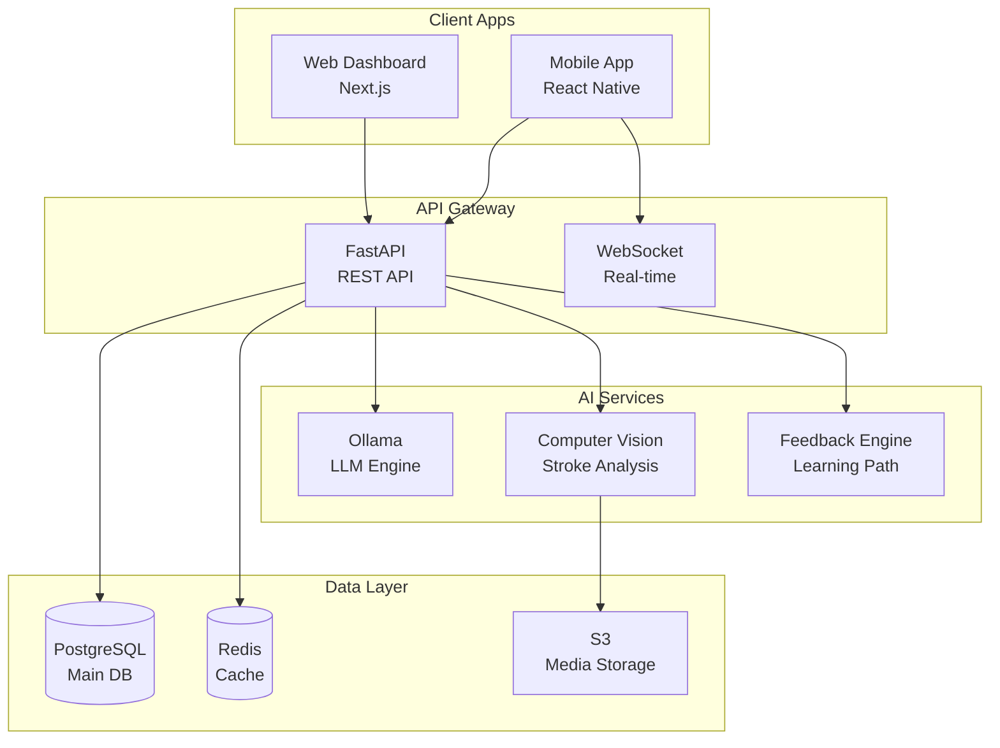
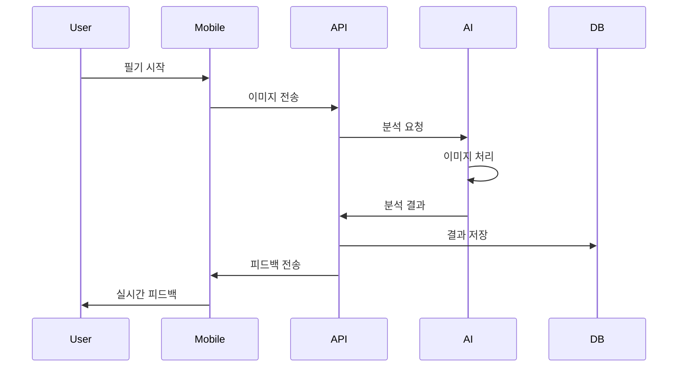

# Project Structure

## 🏗️ 전체 아키텍처

### 시스템 구성도


## 📁 디렉토리 구조

```
calligraphy-coach-v2/
├── apps/                    # 애플리케이션
│   ├── mobile/             # React Native 모바일 앱
│   └── web/                # 관리자 웹 대시보드
├── services/               # 백엔드 서비스
│   ├── api/               # FastAPI REST API
│   ├── ai/                # AI 모델 서빙
│   └── realtime/          # WebSocket 실시간 서버
├── packages/               # 공유 패키지
│   ├── shared/            # 공통 타입/유틸리티
│   └── ui/                # UI 컴포넌트 라이브러리
├── infrastructure/         # 인프라 설정
│   ├── docker/            # Docker 설정
│   ├── k8s/               # Kubernetes 매니페스트
│   └── scripts/           # 배포 스크립트
└── docs/                   # 문서
```

## 🎯 핵심 모듈

### 1. Mobile App (apps/mobile)
**기술 스택**: React Native, Expo, TypeScript, Zustand

**주요 화면**:
- `HomeScreen`: 메인 대시보드
- `CameraScreen`: 실시간 필기 촬영
- `AnalysisScreen`: AI 분석 결과
- `LearningScreen`: 학습 모드
- `ProfileScreen`: 사용자 프로필

**핵심 기능**:
- 실시간 카메라 스트리밍
- 획순 추적 및 시각화
- AI 피드백 표시
- 오프라인 모드 지원

### 2. Backend API (services/api)
**기술 스택**: FastAPI, SQLAlchemy, Pydantic, Alembic

**API 구조**:
```
/api/v1/
├── auth/          # 인증/인가
├── users/         # 사용자 관리
├── analysis/      # 필기 분석
├── feedback/      # AI 피드백
├── learning/      # 학습 경로
└── progress/      # 진도 추적
```

**핵심 엔드포인트**:
- `POST /analysis/analyze`: 이미지 분석 요청
- `GET /feedback/{analysis_id}`: 피드백 조회
- `POST /learning/generate`: 학습 경로 생성
- `GET /progress/stats`: 진도 통계

### 3. AI Services (services/ai)
**기술 스택**: Ollama, OpenCV, TensorFlow, FastAPI

**AI 모델**:
- **Stroke Analysis**: 획순 정확도 평가
- **Character Recognition**: 문자 인식
- **Posture Detection**: 자세 분석
- **Feedback Generation**: 맞춤형 피드백 생성

**처리 파이프라인**:
1. 이미지 전처리
2. 특징 추출
3. 모델 추론
4. 결과 후처리
5. 피드백 생성

## 🔌 통합 포인트

### API 통신
```typescript
// Mobile → API
interface AnalysisRequest {
  image: string;        // Base64 encoded
  mode: 'korean' | 'chinese';
  level: 'beginner' | 'intermediate' | 'advanced';
}

// API → Mobile
interface AnalysisResponse {
  id: string;
  score: number;
  feedback: Feedback[];
  suggestions: string[];
}
```

### WebSocket 실시간 통신
```typescript
// Real-time stroke tracking
interface StrokeData {
  points: Point[];
  pressure: number;
  timestamp: number;
}

// Live feedback
interface LiveFeedback {
  type: 'correct' | 'warning' | 'error';
  message: string;
  position: Point;
}
```

## 🚀 배포 구조

### Development
- Local Docker Compose
- Hot reload 지원
- Mock AI 서비스

### Staging
- Kubernetes 클러스터
- 실제 AI 모델
- 성능 모니터링

### Production
- Multi-region 배포
- Auto-scaling
- CDN 통합
- 실시간 모니터링

## 📊 데이터 플로우



## 🔧 개발 환경 설정

### 필수 요구사항
- Node.js 18+
- Python 3.10+
- Docker Desktop
- Xcode (iOS 개발)
- Android Studio (Android 개발)

### 포트 할당
| 서비스 | 포트 | 설명 |
|--------|------|------|
| Mobile Metro | 3000 | React Native 개발 서버 |
| Web Dashboard | 3001 | Next.js 개발 서버 |
| API Server | 8000 | FastAPI REST API |
| AI Server | 8001 | AI 모델 서빙 |
| WebSocket | 8002 | 실시간 통신 |
| Ollama | 11434 | LLM 엔진 |
| PostgreSQL | 5432 | 메인 데이터베이스 |
| Redis | 6379 | 캐시 서버 |

## 🔐 보안 고려사항

- JWT 기반 인증
- API Rate Limiting
- 이미지 업로드 크기 제한
- SQL Injection 방지
- XSS/CSRF 보호
- HTTPS 강제
- 민감 데이터 암호화

---
*자세한 기술 스택과 설정은 각 서비스의 README.md를 참조하세요.*